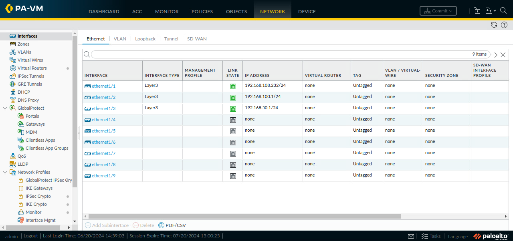
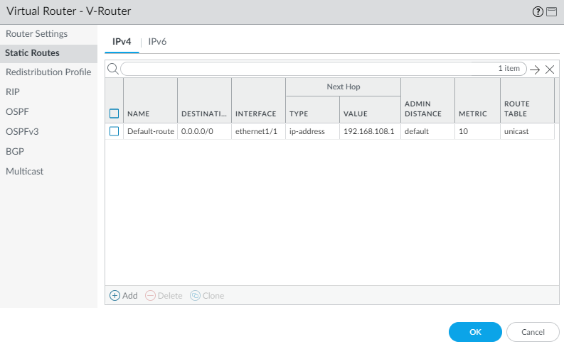
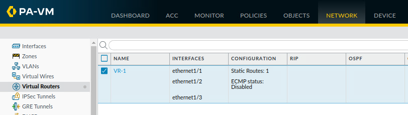
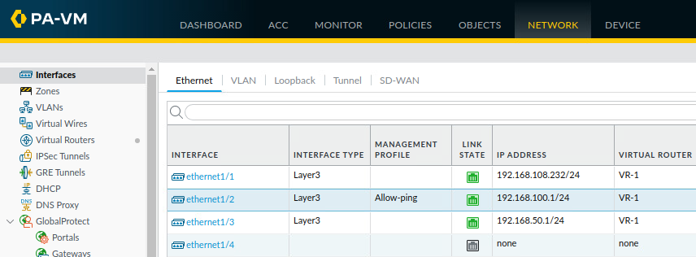
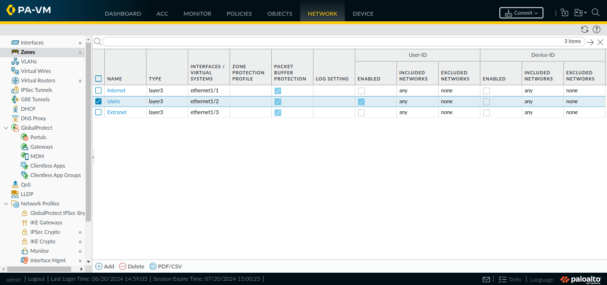
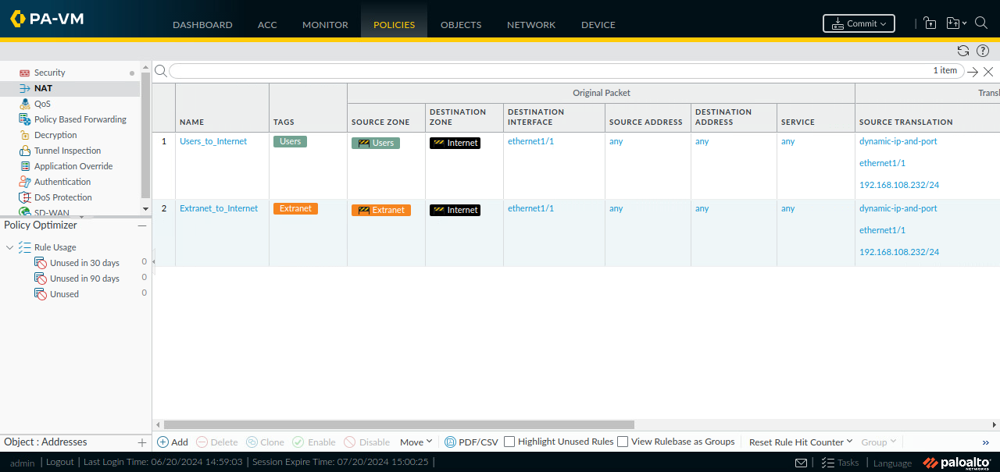
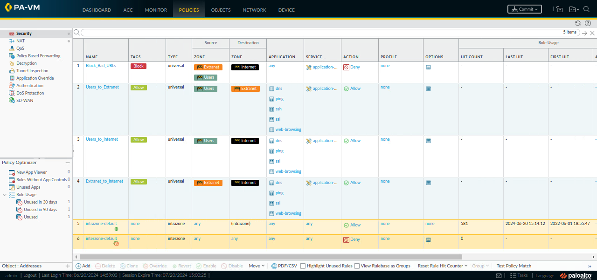
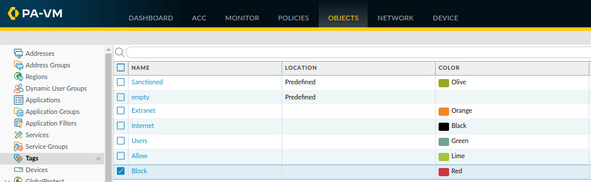
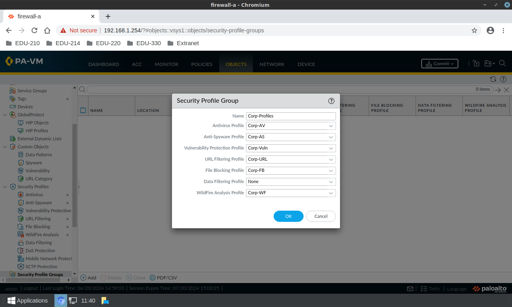

# Lab 18 - Capstone Palo Alto Project

The below configurations were performed in NETLAB to prevent any issues with the production Palo Alto firewall.

### <ins>Configure Networking</ins>

#### Configure interfaces:  
*Network > Interfaces > Ethernet*

#### Configure virtual router:  
*Network > Virtual Routers*    
- Create a default route 0.0.0.0/0
  
  

#### Configure interface management profile:  
*Network > Interface Mgmt*

### <ins>Configure Security Zones</ins>
*Network > Zones*  
- Internet: ethernet1/1
- Users: ethernet1/2
  - Configure User-ID
- Extranet: ethernet1/3

#### Create security zone tags:  
*Objects > Tags*

### <ins>Verify Network Connectivity</ins>

- Internal host can ping 192.168.100.1
- SSH to firewall 192.168.1.1
- insrt img firewall pings ssh cli

### <ins>Configure NAT Policy Rules</ins>
*Policies > NAT*  

Source NAT:
- Users_to_Internet
- Extranet_to_Internet

### <ins>Configure Security Policy Rules</ins>
*Policies > Security*
- Block_Bad_URLs
- Users_to_Extranet
- Users_to_Internet
- Extranet_to_Internet

#### Create security policy tags:  
*Objects > Tags*

#### Testing security policies:

### <ins>Create and Apply Security Profiles</ins>
*Policies > Security*
- Antivirus: Corp-AV
- Anti-Spyware: Corp-AS
- Vulnerability Protection: Corp-Vuln
- URL Filtering: Corp-URL
- File Blocking: Corp-FB
- WildFire Analysis: Corp-WF

---

## Configure Security and NAT policy to access DMZ server from Internet

The following configurations were performed in the Cyber Project CSOC production environment.

### <ins>Part 1 - Configure destination NAT policy and security policy</ins>

This will enable remote web access (port 80) to the DMZ server from the internet zone (E108 PCs).

*Policies > Security*

- outside-to-DMZ-web
  - Application: Web-Browsing

*Policies > NAT*

Destination NAT:
- dstNat-outside-dmz
  - Service: service-http 
  

Testing http from an Internet PC on E108 network:

[http://192.168.108.132]

### <ins>Part 2 - Configure and test remote management</ins>

This will enable remote management access to the DMZ server from one specific IP address within the internet zone (E108 network).
Management IP Address: 192.168.108.9

#### Modifying security and NAT policy for remote management:

*Policies > Security*

- outside-to-DMZ-mgmt
  - Source IP Address: 192.168.108.9
  - Application: ms-rdp, mysql, ssh

*Policies > NAT*

Destination NAT:
- dstNat-outside-dmz
  - Service: any
 

Testing rdp from management IP to DMZ server:

Testing ssh from management IP to DMZ server:

Running nmap scan from internet zone (E108 network) to DMZ server:

