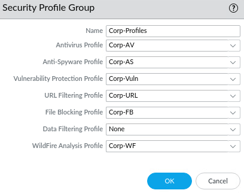

# Lab 18 - Capstone Palo Alto Project

The below configurations were performed in NETLAB to prevent any issues with the production Palo Alto firewall.

### <ins>Configure Networking</ins>

#### Configure interfaces:  
*Network > Interfaces > Ethernet*


*Note: management interface IP should not be changed from 192.168.1.254 on NETLAB!*

#### Configure virtual router:  
*Network > Virtual Routers*    
- Create a default route 0.0.0.0/0
  
  


#### Configure interface management profile:  
*Network > Interface Mgmt*
- Allow-ping: applied to E1/2 (Users zone)


### <ins>Configure Security Zones</ins>
*Network > Zones*  
- Internet: ethernet1/1
- Users: ethernet1/2
  - Configure User-ID
- Extranet: ethernet1/3


#### Create security zone tags:  
*Objects > Tags*

### <ins>Verify Network Connectivity</ins>

- Internal host can ping 192.168.100.1
- 192.168.1.1 can be accessed with Putty SSH client
- Commands below are succesful from the firewall CLI:
  ```
  ping source 192.168.108.232 host 192.168.108.1
  ping source 192.168.108.232 host 8.8.8.8
  ping source 192.168.100.1 host 192.168.100.20
  ping source 192.168.50.1 host 192.168.50.2
  ping source 192.168.50.1 host 192.168.50.100
  ```

### <ins>Configure NAT Policy Rules</ins>
*Policies > NAT*  

Source NAT:
- Users_to_Internet
- Extranet_to_Internet


### <ins>Configure Security Policy Rules</ins>
*Policies > Security*
- Block_Bad_URLs
- Users_to_Extranet
- Users_to_Internet
- Extranet_to_Internet


#### Create security policy tags:  
*Objects > Tags*


#### Testing security policies:

--Insert test images here--

### <ins>Create and Apply Security Profiles</ins>
*Policies > Security*
- Antivirus: Corp-AV
- Anti-Spyware: Corp-AS
- Vulnerability Protection: Corp-Vuln
- URL Filtering: Corp-URL
- File Blocking: Corp-FB
- WildFire Analysis: Corp-WF



--Insert test images here--

---

## Configure Security and NAT policy to access DMZ server from Internet
 
The following configurations were performed in the Cyber Project CSOC production environment.  

### <ins>Part 1 - Configure destination NAT policy and security policy</ins>

This will enable remote web access (port 80) to the DMZ server from the internet zone (E108 PCs).

*Policies > NAT*

Destination NAT:
- dstNat-outside-dmz
  - Service: service-http 
  


*Policies > Security*

- outside-to-DMZ-web
  - Source Address: any
  - Application: Web-Browsing


&nbsp;  

Testing http from an Internet PC on E108 network:

http://192.168.108.132

  


### <ins>Part 2 - Configure and test remote management</ins>

This will enable remote management access to the DMZ server from one specific IP address within the internet zone (E108 network).  
Remote management will be done with SSH, Remote Desktop Protocol (RDP), and MySQL remote administration (port 3306).

**Management IP Address: 192.168.108.9**

 

#### Modifying security and NAT policy for remote management:

*Policies > NAT*

Destination NAT:
- dstNat-outside-dmz
  - Service: any

*Policies > Security*

- outside-to-DMZ-mgmt
  - Source Address: 192.168.108.9
  - Application: ms-rdp, mysql, ssh  


&nbsp;  

Testing rdp from management IP to DMZ server:

 

Testing ssh from management IP to DMZ server:


Running nmap scan from internet zone (E108 network) to DMZ server:


